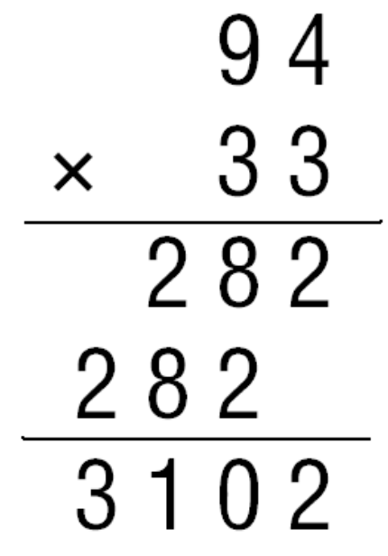

## 1 How we do multiplication


We have learned traditional way to **multiplicate two integers** as follows:





Now let us consider the times of multiplications when inputs are integers with equal length $n$. As each step we take a digit below and multiplicate with a digit above, until we are done with all the digits above, then we take a digit that is adjacent to the digit below that we just took for multiplication. It is apparent that **we will do $$n^2$$ times of multiplications**.


**So, can we do better?**


> Perhaps the most important principle for the good algorithm designer is to refuse to be content.
>
> 
>
> ​                                                                                                KAho,Hopcro`,andUllman,The'Design'and'
>
> ​                                                                                                      *Analysis'of'Computer'Algorithms*,1974


## 2 Karatsuba Multiplication


We know that handling multiplications with long digits is quite hard not to make mistakes during the process above, but we can do simple multiplications like $$21 \times 67$$ well. Can we just ‘break’ the long digits into smaller ones that we can easily handle and get she same result as the school method but with less amount of work?

Let’s take four digits as example: $$1234\times5678$$. We know that


$$
1234 \times 5678 = (12 \cdot 10^2 + 34\cdot 10^0) \times (56 \cdot 10^2 + 78\cdot 10^0).
$$


Then we can rewrite the term on the right of the equation as


$$
1234\times 5678 = (12\times56)\cdot 10^4 + (12\times 78 + 34\times56)\cdot 10^2 + (34\times78)\cdot 10^0.
$$


As shown above, we successfully break large numbers into small ones. When faces with long numbers, we can break them into four pieces. when they need to multiplicate, we have the same problem to solve, but much smaller. So we just carry out the same process. This is called **recursive calls**.


In general, consider multiplication done on two integers $$d_1d_2...d_{2^n}$$ and $$f_1f_2...f_{2^n}$$ with length $$2^n$$, we can recursively compute 


$$
\begin{align}

&d_1d_2...d_{2^n} \times f_1f_2...f_{2^n}\\
= &(d_1..d_{2^{n-1}} \times f_1..f_{2^{n-1}}) \cdot 10^{2^n} + \\
& (d_1..d_{2^{n-1}} \times f_{2^{n-1}+1}..f_{2^{n}} + d_1..d_{2^{n-1}} \times f_{2^{n-1}+1}..f_{2^{n}})\cdot 10^{2^{n-1}} + \\
& (d_1..d_{2^{n-1}} \times f_{2^{n-1}+1}..f_{2^{n}})

\end{align}
$$


## 3 Gauss’ Trick


When doing muptiplication


$$
x\cdot y = (ac)\times10^{2^n} + (ad + bc) \times 10^{2^{n-1}} + (bd)
$$


* Recursively compute $$ac$$
* Recursively compute $$bd$$
* Recursively compute $$(a + b)(c + d)$$


### Body text

Lorem ipsum dolor sit amet, test link adipiscing elit. **This is strong**. Nullam dignissim convallis est. Quisque aliquam.


{: .image-right}

*This is emphasized*. Donec faucibus. Nunc iaculis suscipit dui. 53 = 125. Water is H<sub>2</sub>O. Nam sit amet sem. Aliquam libero nisi, imperdiet at, tincidunt nec, gravida vehicula, nisl. The New York Times <cite>(That’s a citation)</cite>. <u>Underline</u>. Maecenas ornare tortor. Donec sed tellus eget sapien fringilla nonummy. Mauris a ante. Suspendisse quam sem, consequat at, commodo vitae, feugiat in, nunc. Morbi imperdiet augue quis tellus.

HTML and <abbr title="cascading stylesheets">CSS<abbr> are our tools. Mauris a ante. Suspendisse quam sem, consequat at, commodo vitae, feugiat in, nunc. Morbi imperdiet augue quis tellus. Praesent mattis, massa quis luctus fermentum, turpis mi volutpat justo, eu volutpat enim diam eget metus.

### Blockquotes

> Lorem ipsum dolor sit amet, test link adipiscing elit. Nullam dignissim convallis est. Quisque aliquam.

## List Types

### Ordered Lists

1. Item one
   1. sub item one
   2. sub item two
   3. sub item three
2. Item two

### Unordered Lists

* Item one
* Item two
* Item three

## Tables

| Header1 | Header2 | Header3 |
|:--------|:-------:|--------:|
| cell1   | cell2   | cell3   |
| cell4   | cell5   | cell6   |
|----
| cell1   | cell2   | cell3   |
| cell4   | cell5   | cell6   |
|=====
| Foot1   | Foot2   | Foot3
{: rules="groups"}

## Code Snippets

Syntax highlighting via Rouge

```css
#container {
  float: left;
  margin: 0 -240px 0 0;
  width: 100%;
}
```

Non Pygments code example

    <div id="awesome">
        <p>This is great isn't it?</p>
    </div>

## Buttons

Make any link standout more when applying the `.btn` class.

```html
<a href="#" class="btn btn-success">Success Button</a>
```

<div markdown="0"><a href="#" class="btn">Primary Button</a></div>
<div markdown="0"><a href="#" class="btn btn-success">Success Button</a></div>
<div markdown="0"><a href="#" class="btn btn-warning">Warning Button</a></div>
<div markdown="0"><a href="#" class="btn btn-danger">Danger Button</a></div>
<div markdown="0"><a href="#" class="btn btn-info">Info Button</a></div>
