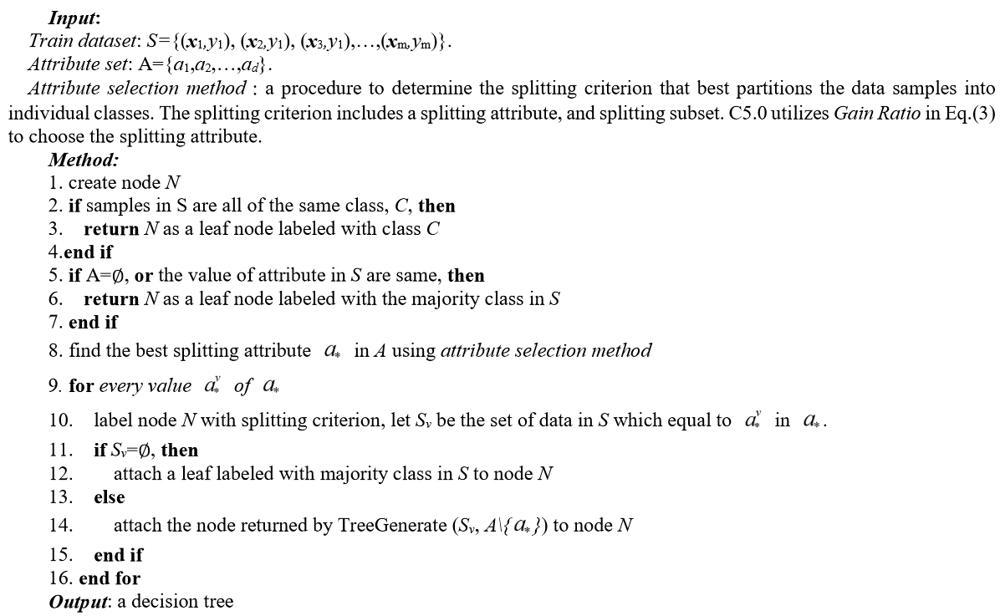

### 1 决策树算法

我们在写程序时也会用到许多的分支语句。而这些分支语句也常常是嵌套的。决策树算法和这个类似。它通过每个训练数据的标签，给出一个**树**，其中的每一个节点是一个判定标准。数据经过这样的标准后将被分割为若干个部分。当然我们最后期望每一个划分的那一些数据尽可能都是同一类的，或者说 “纯度” 要尽量的高。

下面递归的给出决策树算法：

但我们很容易注意到一点：该算法中并没有提及如何判定一个属性是不是最优的。这也是接下来需要讨论的问题

### 2 划分选择的依据

#### 2.1 信息论

#### 2.2 信息增益

#### 2.3 Gini指数

#### 2.4 卡方统计量

### 3 处理连续值与缺失值

### 3* 随机森林

---

### 4 感知机算法

### 5 误差反向传播

### 6 RBF网络

### 7 ART网络

### 8 SOM网络

### 9 级联相关网络

### 10 Elman 网络

### 11 Boltzmann 机

### 12 深度学习

### 0 参考文献

[1] Yajing, Zhang & Chi, Guotai & Zhang, Zhipeng. (2018). Decision tree for credit scoring and discovery of significant features. Filomat. 32. 10.2298/FIL1805513Z. 

[2] https://rpubs.com/chidungkt/451329

[3] https://towardsdatascience.com/clearly-explained-top-2-types-of-decision-trees-chaid-cart-8695e441e73e

[4] https://zhuanlan.zhihu.com/p/470170165

