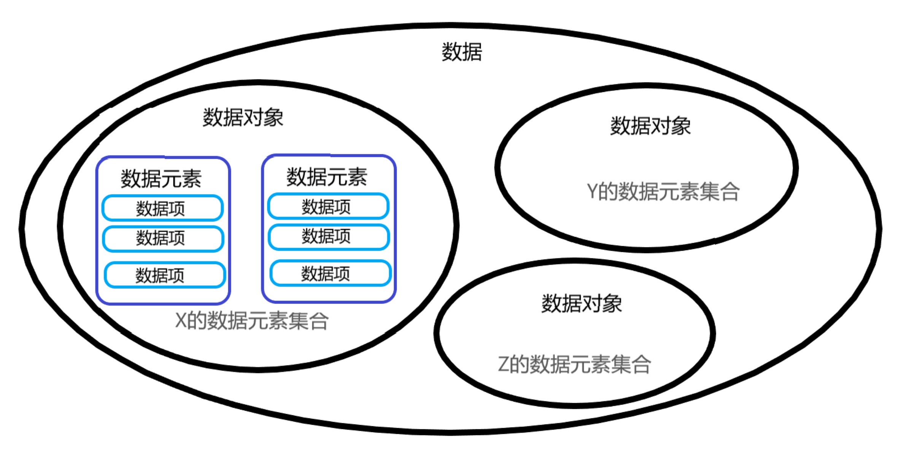

## 1 数据结构概论

### 1.1 何为数据结构

* **数据结构**是研究非数值计算的程序设计问题中的操作对象及它们之间的关系和操作的学科
* 应该**先从具体问题中抽象出适当的数据模型**，设计解决数据模型的算法，最后得到目的软件
* **程序设计** = **数据结构** + **算法**

**基本概念**

* **数据**——描述客观事物的符号。包括数值类型和非数值类型（如图像、音频、视频等，但究其本质也是数值类型）
* **数据元素**——组成数据的、有一定定义的基本单位。用于描述一个个体。例如一个学生有其姓名、性别、专业等描述信息，它们一起构成一个数据元素。
* **数据项**——一个数据元素的组成部分，是数据不可分割的最小单位
* **数据对象**——性质相同的数据元素的集合，是数据的子集
* **数据结构**——相互之间存在一种或多种特定关系的数据元素集合。我们将这个集合以及其上的那一种或几种关系称为**结构**

### 1.2 逻辑结构和物理结构

* **逻辑结构**是指数据对象中的数据元素之间的相互关系，如集合、线性、非线性结构
  * **集合结构**：集合中的数据同属于这个集合
  * **线性结构**：除了最后一个元素以外，每个元素都有惟一后继元素；除了第一个元素以外，每个元素都有惟一前驱元素
  * **树结构**：除了根节点外，每个元素都有惟一前驱；除了叶节点外，每个元素至少有一个后继
  * **图结构**：每个节点至少有一个前驱或至少有一个后继
* **物理结构**是指数据的逻辑结构在计算机存储中的实际存储方式
  * **顺序存储结构**：将数据依次放在连续的存储单元中
  * **链式存储结构**：数据并不依次存放，每个数据后至少带有一个指向下一数据的存储位置的地址

### 1.3 数据类型

* 数据类型按照值的不同进行划分
* 在高级语言中通常按照值的不同特性将数据类型划分为两类：
  * **原子类型**：整形、实型、字符型等
  * **结构类型**：结构体、数组等
* **抽象数据类型**：一个**数学模型**及**定义在该模型上的一组操作**
