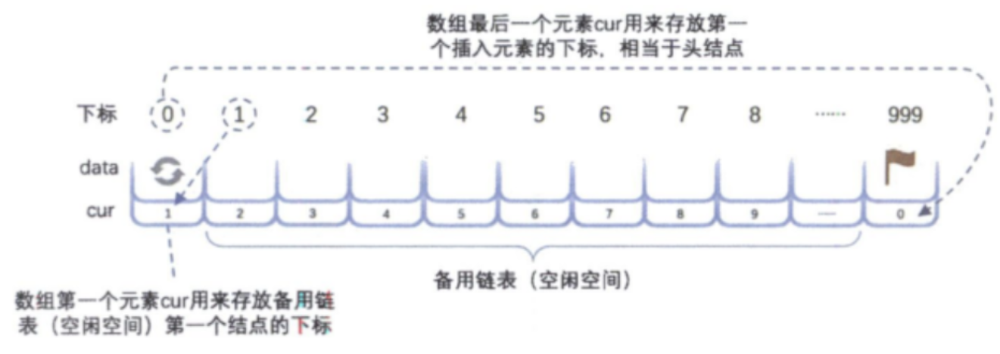
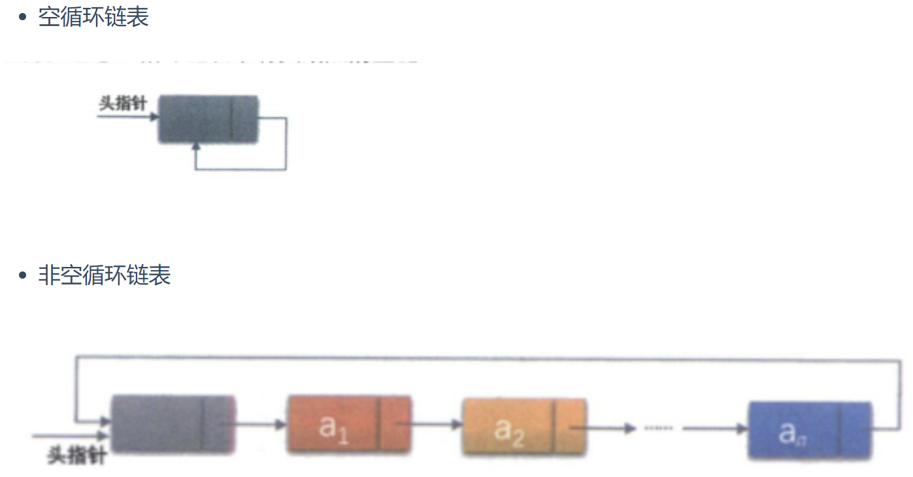
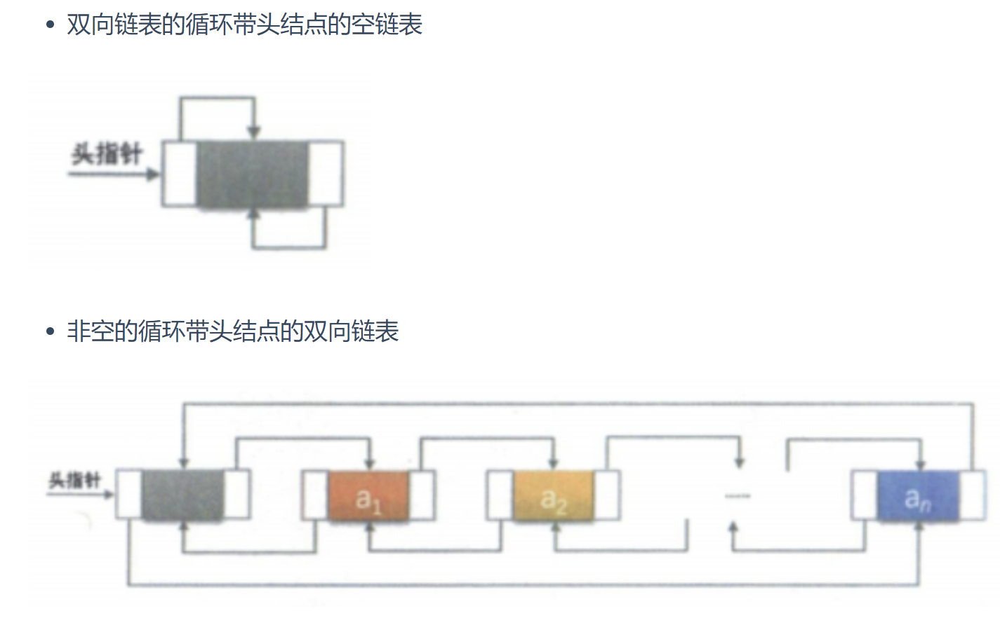

## 3 线性表


* **线性表**：零个或多个数据元素的有限序列，我们定义线性表的长度为其所含元素的个数
* 线性表的每个元素若有前驱或后继元素，则该元素唯一
* 当线性表中没有元素时，称之为**空表**，我们定义空表的长度为$0$


### 3.1 线性表的抽象数据类型

**数据**

集合$\{a_1,a_2,...,a_n\}$，每个元素类型均为`DataType`。除了首元素以外，每个元素都有一个唯一的前驱元素，除了尾元素外，每个元素都有一个唯一的后继元素。

**操作**

| 操作名                  | 解释                                                         |
| ----------------------- | ------------------------------------------------------------ |
| `InsertList(*L)`        | 建立一个空表`L`                                              |
| `ListEmpty(L)`          | 判断表`L`是否为空                                            |
| `ClearList(*L)`         | 清空表`L`                                                    |
| `GetElem(L, i, *e)`     | 将表`L`中下标为`i`的元素返回给`e`                            |
| `LocateElem(L, e)`      | 将表`L`中查找第一个与`e`相同的元素，查找成功返回对应元素的下标，否则返回`-1` |
| `ListInsert(*L, i, e)`  | 在线性表`L`中下标为`i`的地方插入新元素`e`                    |
| `ListDelete(*L, i, *e)` | 删除表`L`中下标为`i`的元素，并将其通过`e`返回                |
| `ListLength(L)`         | 返回线性表`L`的元素个数                                      |


**基本用法1 将所有表`Lb`中但不在表`La`中的元素插入到表`La`中**

```C++
void unionL(SqList* La, SqList* Lb)
{
    int La_len, Lb_len, i;
    ElemType e;
    
    La_len = ListLength(*La);
    Lb_len = ListLength(*Lb);
    
    for(i = 0; i < Lb_len; i++)
    {
        GetElem(Lb, i, &e);
        if(LocateElem(*La, e) != -1)
            ListInsert(La, ++La_len, e);
    }
}
```


### 3.2 顺序存储的线性表


```C++
#define MAXSIZE 20

typedef int ELemType;
typedef struct
{
    ElemType data[MAXSIZE];
    int length;
}SqList;
```


**线性表元素的地址**
$$
\text{Address}(a_{i+k}) = \text{Address}(a_i) + k\cdot \text{SizeOf}(\text{ElemType})
$$
由此可见这样的表结构的存取性能为$O(1)$，我们称之为**随机存储结构**


**查找**

```C++
int GetElem(SqList L, inti, ElemType* e)
{
    if(L.length == 0 || i < 0 || i >= L.length)
        retrun 0;
    *e = L.data[i];
    
    return 1;
}
```


**插入**

```C++
int ListInsert(SqList* L, int i, ElemType e)
{
    int k;
    if(L->length == MAXSIZE)
        return 0;
    if(i < 0 || i >= L->length)
        return 0;
    
    if(i < L->length - 1)
    {
        for(k = L->length - 1; k >= i; k--)
            L->data[k+1] = L->data[k];
    }
    L->data[i] = e;
    L->Length ++;
    
    return 1;
}
```


**删除**

```C++
int ListDelete(SqList* L, int i, ElemType* e)
{
    int k;
    if(L->length == MAXSIZE)
        return 0;
    if(i < 0 || i >= L->length)
        return 0;
    
    *e = L->data[i];
    
    if(i < L->length - 1)
    {
        for(k = i; k < L->length - 1; k++)
            L->data[k] = L->data[k+1];
    }
    L->Length --;
    
    return 1;
}
```


**顺序存储结构的优缺点**

*优点*

* 不需要为表中元素的逻辑关系增加存储空间
* 可以快速存取某一位置的元素

*缺点*

* 插入删除操作需要移动大量元素
* 线性表长度变化较大时难以确定开辟的存储空间容量
* 容易造成存储空间碎片


### 3.3 链式存储的线性表

**元素组成**

* 数据域：存放一个数据
* 指针域：存放指向下一个元素的指针
* 结点：数据域和指针域的合称

**一般规定，单链表的最后一个节点的指针域指向空值`NULL`，通常用一个指针指向链表的第一个元素，称为头指针。当然，头指针不是必需的**

```C++
typedef struct Node
{
    ElemType data;
    struct Node* next;
}Node;
typedef struct Node* LinkList;
```


**读取**：返回链表中第`i`个元素的值（从`0`开始）

```C++
/* head指向第一个节点 */
int GetElem(LinkList* head, int i, ElemType* e)
{
    int j = 0;
    LinkList* p = new LinkList;
    p = head;
    while(p && j < i)
    {
        p = p->next;
        j++;
    }
    if(!p || j > i)
        return 0;
    *e = p->data;
    return 1;
}
```


**插入**：在第`i`个节点之前插入一个新的节点

```C++
int ListInsert(LinkList* head, int i, ElemType e)
{
    int j = 0;
    LinkList* p = new LinkList;
    p = head;
    // 向前一直数到那一个节点
    while(p && j < i)
    {
        p = p->next;
        j++;
    }
    if(!p || j > i)
        return 0;
    
    LinkList* tmp = new Linklist;
    
    tmp->data = e;
    tmp->next = p->next;
    p->next = tmp;
    
    return 1;
}
```


**整表创建——头插法**

```C++
void CreateListHead(LinkList* head, int n)
{
    LinkList* p;
    int i;
    srand(time(0));
    head = new LinkList;
    head->next = NULL;
    
    for(i = 0; i < n; i++)
    {
        p = new LinkList;
        p->data = rand()%100 + 1;
        p->next = L;
        L = p;
    }
}
```


**整表创建——尾插法**

```C++
void CreateListTail(LinkList* L, int n)
{
    LinkList* p, r;
    int i;
    srand(time(0));
    head = new LinkList;
    head->next = NULL;
    r = L;
    r->data = rand()%100 + 1;
    
    for(i = 1; i < n; i++)
    {
        p = new LinkList;
        p->data = rand()%100 + 1;
        p->next = NULL;
        r->next = p;
        r = r->next;
    }
}
```


**整表删除**

```C++
int ClearList(LinkList* head)
{
	LinkList* p;
    LinkList* q;
    p = head;
    
    while(p)
    {
        q = p->next;
        delete p;
        p = q;
    }
    head->next = NULL;
    retrun 1;
}
```


**单链表与顺序存储结构的对比**

|              | **顺序存储结构**                                 | **单链表**                                             |
| ------------ | ------------------------------------------------ | ------------------------------------------------------ |
| 存储分配方式 | 使用连续的存储单元存储数据                       | 采用链式存储结构，存储方式灵活                         |
| 时间性能     | 查找 $O(1)$<br />插入和删除 $O(n)$               | 查找 $O(n)$<br />插入和删除（在找到正确位置后） $O(1)$ |
| 空间性能     | 需要预先估计存储空间大小，容易发生溢出和产生浪费 | 不需要分配存储空间，但需要留意不产生内存碎片           |


### 3.4 静态链表

对于没有指针的高级语言可以用数组代替指针描述单链表：数组的元素由两个数据域组成（`data`和`cur`，后者被称为游标，就相当于指针）。我们将这样的数组结构称为静态链表

```C++
#define MAXSIZE 1000

typedef struct
{
    ElemType data;
    int cur;
} Component, StaticLinkList
```




### 3.5 循环链表




### 3.6 双向链表




### 练习

#### [3.5.1 P3156 【深基15.例1】询问学号-简单](https://joker-lkc.github.io/sweetalk-data-structure/#/ch03/ch03?id=_351-p3156-【深基15例1】询问学号-简单)

[P3156 【深基15.例1】询问学号 - 洛谷 | 计算机科学教育新生态 (luogu.com.cn)](https://www.luogu.com.cn/problem/P3156)

#### [3.5.2 P3613 【深基15.例2】寄包柜-简单](https://joker-lkc.github.io/sweetalk-data-structure/#/ch03/ch03?id=_352-p3613-【深基15例2】寄包柜-简单)

[P3613 【深基15.例2】寄包柜 - 洛谷 | 计算机科学教育新生态 (luogu.com.cn)](https://www.luogu.com.cn/problem/P3613)

#### [[3.5.3 P1047 NOIP2005 普及组] 校门外的树-简单](https://joker-lkc.github.io/sweetalk-data-structure/#/ch03/ch03?id=_353-p1047-noip2005-普及组-校门外的树-简单)

[P1047 [NOIP2005 普及组\] 校门外的树 - 洛谷 | 计算机科学教育新生态 (luogu.com.cn)](https://www.luogu.com.cn/problem/P1047)

#### [3.5.4 P1160 队列安排-中等](https://joker-lkc.github.io/sweetalk-data-structure/#/ch03/ch03?id=_354-p1160-队列安排-中等)

[P1160 队列安排 - 洛谷 | 计算机科学教育新生态 (luogu.com.cn)](https://www.luogu.com.cn/problem/P1160)

#### [3.5.5 P1996 约瑟夫问题](https://joker-lkc.github.io/sweetalk-data-structure/#/ch03/ch03?id=_355-p1996-约瑟夫问题)

[P1996 约瑟夫问题 - 洛谷 | 计算机科学教育新生态 (luogu.com.cn)](https://www.luogu.com.cn/problem/P1996)


