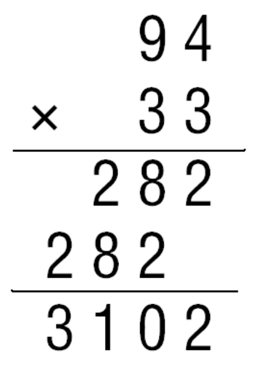

## 1 How we do multiplication

We have learned traditional way to **multiplicate two integers** as follows:

Now let us consider the times of multiplications when inputs are integers with equal length $n$. As each step we take a digit below and multiplicate with a digit above, until we are done with all the digits above, then we take a digit that is adjacent to the digit below that we just took for multiplication. It is apparent that **we will do $n^2$ times of multiplications**.

**So, can we do better?**

> Perhaps the most important principle for the good algorithm designer is to refuse to be content.
>
> 
>
> ​                                                                                                KAho,Hopcro`,andUllman,The'Design'and'
>
> ​                                                                                                      *Analysis'of'Computer'Algorithms*,1974

## 2 Karatsuba Multiplication

We know that handling multiplications with long digits is quite hard not to make mistakes during the process above, but we can do simple multiplications like $21 \times 67$ well. Can we just ‘break’ the long digits into smaller ones that we can easily handle and get she same result as the school method but with less amount of work?

Let’s take four digits as example: $1234\times5678$. We know that
$$
1234 \times 5678 = (12 \cdot 10^2 + 34\cdot 10^0) \times (56 \cdot 10^2 + 78\cdot 10^0).
$$
Then we can rewrite the term on the right of the equation as
$$
1234\times 5678 = (12\times56)\cdot 10^4 + (12\times 78 + 34\times56)\cdot 10^2 + (34\times78)\cdot 10^0.
$$
As shown

3 

